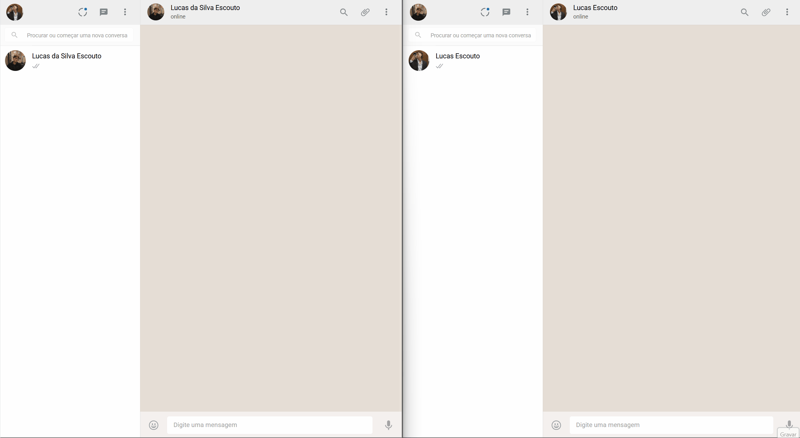

# Projeto WhatsApp Clone

<p align="center">
  
  
  
  
  
</p>

---

## Sobre o Projeto

Este projeto consiste em um **clone do WhatsApp Web**, desenvolvido utilizando **JavaScript**, **Node.js**, **Express** e serviços do **Firebase**, seguindo uma arquitetura **Client-Server** moderna e escalável.

A aplicação foi construída com foco em:

- comunicação em tempo real;
- renderização dinâmica de componentes;
- upload e gerenciamento de arquivos;
- autenticação segura;
- integração entre Front-End e Back-End.

O sistema simula funcionalidades presentes no WhatsApp Web, proporcionando uma experiência moderna e interativa.

---

## Preview da Aplicação

<p align="center">
  
</p>

---

# Funcionalidades

- ✅ Login e autenticação com Firebase Authentication  
- ✅ Envio de mensagens em tempo real  
- ✅ Upload de imagens  
- ✅ Upload e reprodução de áudios  
- ✅ Compartilhamento de arquivos PDF  
- ✅ Captura de áudio via microfone  
- ✅ Atualização dinâmica das conversas  
- ✅ Integração com Cloud Firestore  
- ✅ Firebase Storage  
- ✅ Cloud Functions  
- ✅ Interface inspirada no WhatsApp Web  
- ✅ Arquitetura Client-Server  

---

# Arquitetura da Aplicação

A estrutura do projeto segue o padrão:

```txt
Client → API REST → Firebase Services
```

### Divisão da Aplicação

### Front-End
Responsável pela interface da aplicação e renderização dinâmica dos componentes.

### Back-End
API desenvolvida com Node.js e Express para gerenciamento das regras de negócio e integração com Firebase.

### Firebase Services
Utilização dos serviços:

- Firebase Authentication
- Cloud Firestore
- Firebase Storage
- Cloud Functions

---

# Tecnologias Utilizadas

| Tecnologia | Descrição |
|---|---|
| JavaScript | Linguagem principal da aplicação |
| Node.js | Ambiente de execução |
| Express.js | Servidor Backend |
| Firebase Authentication | Sistema de autenticação |
| Cloud Firestore | Banco de dados em tempo real |
| Firebase Storage | Armazenamento de arquivos |
| Cloud Functions | Funções serverless |
| Webpack | Build da aplicação |
| PDF.js | Visualização de arquivos PDF |
| MediaDevices API | Captura de áudio |

---

# 📂 Estrutura do Projeto

```bash
Projeto-Whatsapp/
│
├── audio/
├── css/
├── dist/
├── functions/
├── img/
├── js/
├── node_modules/
├── package.json
├── firebase.json
└── webpack.config.js
```

---

# Como Executar o Projeto

> Este projeto foi desenvolvido utilizando exclusivamente o **Node.js v16.20.2**.
>
> Recomenda-se utilizar exatamente esta versão para evitar incompatibilidades entre dependências.

---

## 1️⃣ Instale o Node.js

🔗 Download oficial:

https://nodejs.org/dist/v16.20.2/

---

## 2️⃣ Clone o Repositório

```bash
git clone https://github.com/lucasescouto-ux/Projeto-Whatsapp.git
```

---

## 3️⃣ Acesse a Pasta do Projeto

```bash
cd Projeto-Whatsapp
```

---

## 4️⃣ Instale as Dependências

```bash
npm install
```

---

## 5️⃣ Execute a Aplicação

```bash
npm start
```

---

# Configuração do Firebase

Para executar corretamente a aplicação, é necessário configurar um projeto no Firebase contendo:

- Firebase Authentication
- Cloud Firestore
- Firebase Storage
- Cloud Functions

Após criar o projeto, adicione as credenciais da aplicação no arquivo de configuração correspondente.

---

# Scripts Disponíveis

| Script | Descrição |
|---|---|
| `npm start` | Inicia o servidor |
| `npm run build` | Gera build de produção |
| `npm test` | Executa os testes |
| `npm run serve` | Inicia o emulador Firebase |
| `npm run deploy` | Realiza deploy das Functions |
| `npm run logs` | Exibe logs das funções |

---

# Recursos Utilizados

| Recurso | Link |
|---|---|
| Webpack | https://webpack.js.org/ |
| Firebase Docs | https://firebase.google.com/docs |
| PDF.js | https://mozilla.github.io/pdf.js/ |
| MediaDevices API | https://developer.mozilla.org/pt-BR/docs/Web/API/MediaDevices/getUserMedia |

---

# Aprendizados

Durante o desenvolvimento deste projeto foram aprofundados conhecimentos em:

- Arquitetura Client-Server;
- Node.js;
- Firebase;
- Comunicação em tempo real;
- Manipulação e upload de arquivos;
- Renderização dinâmica;
- Estruturação de aplicações escaláveis;
- Integração entre Front-End e Back-End.

---

Projeto criado para a trilha de desenvolvimento da **Saipos**.

---